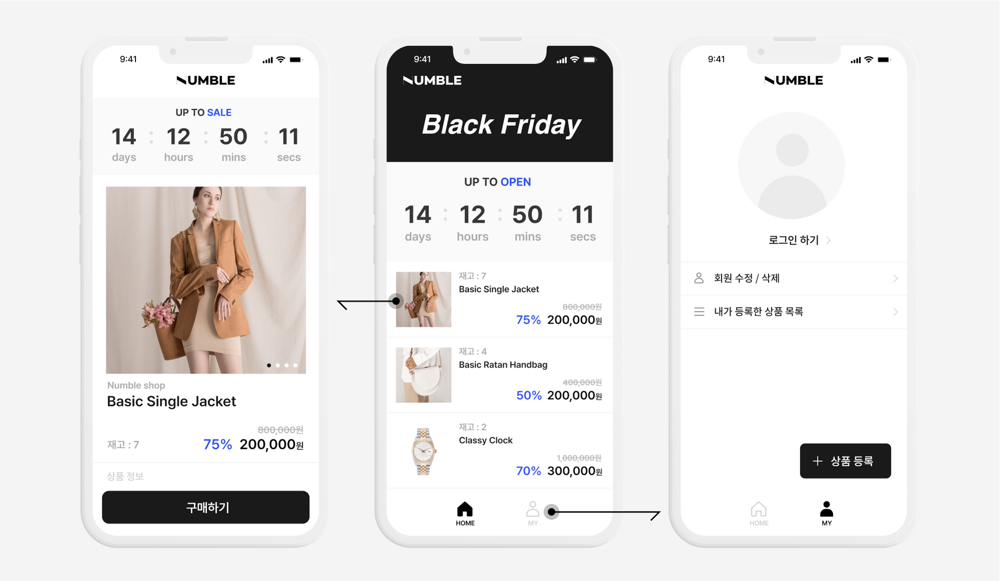

## 예시 화면

구현범위

    지정된 시간에만 상품 구매가 가능하게 함

    상품에는 재고수량이 있어 모두 판매되면 더이상 구매할 수 없어야 함

    상품을 구매한 사람 수과 상품의 재고수량이 일치해야 함

    장바구니 담기 및 결제하기 같은 구매하기 뒷단의 로직은 생략하고 오직 구매하기 API 를 호출했을 때 구매하기 성공 / 실패로 구분

구현기능

    상품 : 등록/수정/삭제/목록/상세 기능

    구매 : 구매하기 기능

구현조건

    CI / CD 필수

    성능테스트를 통해 구매하기 API가 TPS가 얼마나 나오는지 체크할 수 있어야 함

    spring boot 버전은 크게 중요하지 않지만 2.x 이상을 사용하기를 권장

    성능테스트를 위해 nGrinder를 설치
        만들었던 API의 TPS가 얼마나 나오는지 체크할 수 있어야 함
        필요하다면 성능테스트를 위해 작성한 스크립트 또한 git으로 관리

    어플리케이션의 상태를 점검할 수 있는 APM 툴 도입 필수
        pinpoint나 scouter를 추천
        성능 테스트 시 이를 활용하여 상태를 점검하고 성능 테스트 결과와 함께 리포팅

    서버는 1대만 구성하는 것으로 정의
        여러대의 서버를 구성 할 수 도 있지만 현 챌린지의 규모상 1대로 제한

    ORM은 JPA와 MyBatis 중 사용하기 편한 것으로 선택해서 진행

    각 도메인(테이블)의 요소(필드) 들은 자유